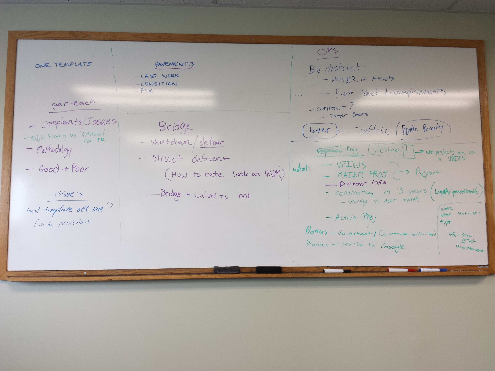
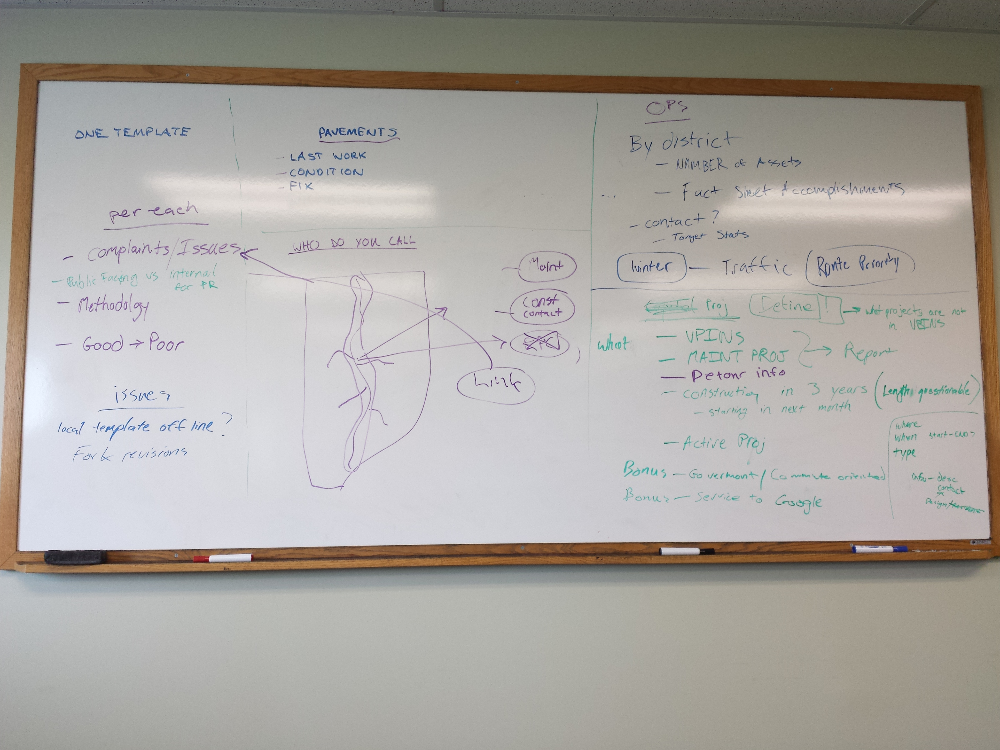

#User Stories

##Struggle #1: Getting people to use it
_How do we know if they've used it? How do we track their interaction?_ **Analytics!**

Tie the "Why" into every answer we give
Anything that can improve VPINS is a great goal 
###Pavement

- My road is in terrible condition. When did you last do work here?
- What is the actual condition?
- When will it next be paved?

Concept:
Why we do what we do?
  - Public fills out public problem 
  - Email auto-responder about how we decide - this may answer many questions
  - Have a little more detailed explanation below
  - Then they respond if they are still concerned - goes to district personnel

###Bridge
  - Shutdown\Detour clearly defined/displayed warned in advance
  - Construction
  - Structurally deficient
  - NBI - how we rate - UVM
  - "Town Short vs Town Long vs UltraShort" -> just bridges

###OPS Top 10

Trying to get districts back to doing maintenance instead of mini projects.

Ditching
Culvert 
Guardrails
Mowing
Litter
Tree Trimming
Plowing

Show the public a regional picture of activities at a district level - aggregate stats. "We're doing things"

Accomplishments: How many plug joints, how many bridges washed
Mimic Filkorn's fact sheet to legislature 

This sounds like a great place for D3

Also have asset stats - how many culverts per district - emergency summary 

Ex: Litter picking - where and how much

Wishlist/Dream
Plow tracking
Route priority map

###Capital Projects

What are capital projects

What do we map?
- VPINS
- Maintenance projects

They will ask us for planned maintenance projects
- From the public's perspective, a large culvert repair isn't different than a project

Things we can't map go into a report

What do we share?
- Construction year (next 3 years)
- What projects are going to start THIS MONTH? (time slider option)
- Get emails when a project in your area or on your commute 
  - Tie into GoVT? BONUS
  - Send construction feed to Google for re-routing?
  - AGO already has routing

Where
When (Start-end)
Type
Info - description
Point of Contact - one person "Project Manager"

###Who do I call?

Why do people call?
- Maintenance
- Construction
- 

Who do they call?
- Regions
  - DTA
  - RCE
- Projects
- RPC's
- Maintenance

How do we direct them?
Click a point, buffer around it, who do they call?
Show a blank map with just some simple polygons

#Whiteboard Pictures

