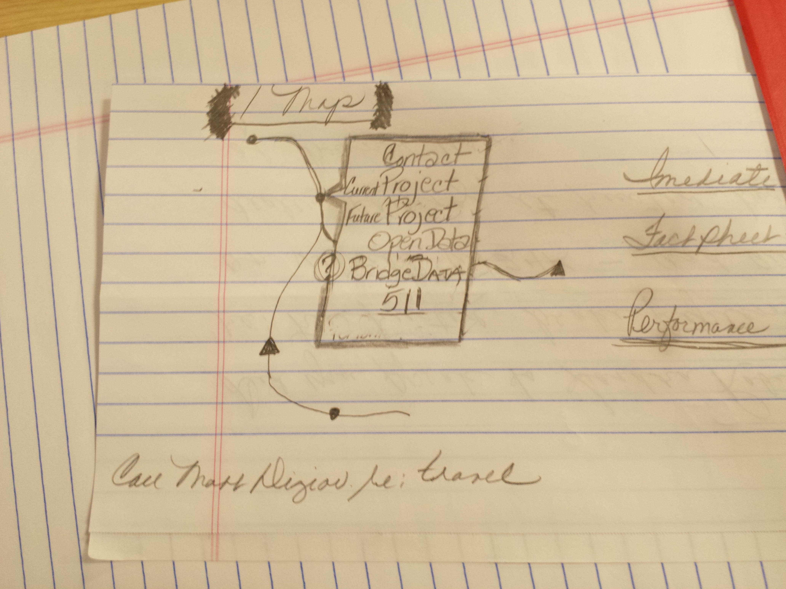

#Timebox 1 Review Notes

**Attendees**
- Viani
- Kiniry
- Smith
- Lofgren
- Allen
- Robie
- Teatrault
- DiGiovanni FHWA
- Hake FHWA
- Scott
- Nailor
- Rogers
- Marshia
- Devlin
- Hurd
- Ahern
- Symonds
- Narowski
- Filkorn
- Holden

No presentation, just a show and tell

###Website dev story

###Pavement demo

Teatrault - Next planned projects for pavement?

###Projects map

Robie - the construction dates aren't focused on

Marshia - We're serving out the data because we have to. That will force us to make it correct.

Viani - Only turn on data when it gets to a certain phase. Don't show planned completion until it's out to bid.

Nailor - Even if it's rough, we need to let the public know what to expect.

###Who do I call? demo

Teatrault - Will people on a smartphone going to be able to click on the phone number?

Filkorn - Live email links too

Marshia - Talk about the sustainability of the data.

Rodgers - SeeClickFix will require good contacts data, so maybe that will help solve the data sustainability issues

###Bridges demo

Symonds - We'll have project datasheets or a website by the first of the year for bridge projects. The closures data isn't sustainable right now. Should probably be in VPINS.

Holden - How do you tie 511 data into this?

###Maintenance demo

Tetrault - Teriffic work. Statewide innovation team here. This sabbatical is a test drive modeled after Irene to implement new strategies in the agency. It's unclear to me along the way - what is the framework, what is the product we're looking for? Boldness, sustainability, what does the customer want? We (executives) have lots of thougths. How do we make sure you're focusing on the big hits? 

Viani - Allen, Filkorn giving us feedback daily. Template map, website. We get the 80%, then get the feedback at the end. 

Tetrault - That's good. There are data that we can't sustain right now - so what? We'll make it happen if it matters. Let's not shy away from something bold.

Viani - Everything has to go back to the sources. 

Tetrault - Just challenging you to stay on the path.

Marshia - We're also capturing a 'parking lot' of issues and items. This is a tool to expose issues.

##Open Data portal demo

###What are your thoughts?

Rogers - The public views road activity as a project. How do we show planned maintenance? 

Viani - We're just using VPINS right now, but you could also do it in MATS.

Nailor - Whichever one best suits the Agency.

Allen - It's appealing to track maintenance operations from an asset management standpoint. The public just knows that's something is in the way

Marshia - You could point them to this website

Scott - This shows us that there are things that are needed internally too. This is a starting point for those developments.

Allen - Performance measures could be communicated too.

Tetrault - This strategy seems to have some merit. **In the wrap up report: do we plan for one of these quarterly?**

Viani - This has been incredible. It's difficult, so maybe deploy as needed.

Scott - Lots of benefits: cross training, developing. It's a boost. Use the model in other places - bring in one person from before + 4 new ones and have them target a new project. This works as a maintenance tool, but also as a boost to other parts of the agency. "Shot in the arm"

Rodgers - Chad mentioned a dashboard. Could we build one here? Performance measures?

Allen - The responsiveness is right

Nailor - *Email the link to everyone*  

Tetrault - What if we had a flood tomorrow. We need a data collection system that's fed through this portal. "My road is washed out" from the public. This whole development reminds me of UPlan. What are the top 10 worst roads in the state? Who owns the parts when they break?

Nailor - I'm wondering about the process. What are the 'tiers' of efforts? What can we accomplish in 2 days? In 5? In 2 weeks?

Holden - Master map - when you click on something, get a popup menu of what you want. Link out to each section that can be used at a clicked spot

